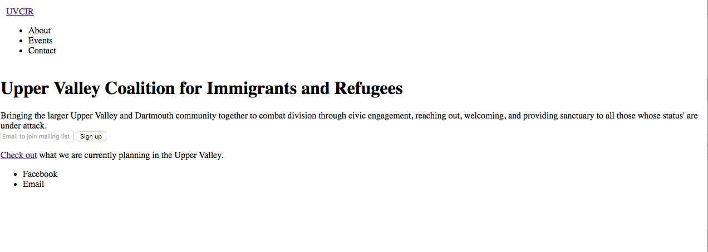

I made a nav and footer and a very padded landing page.
I have another branch where I did the checkbox hack but I don't like how the child had to inherit a tiny width, so I left it on the `responsive` branch.
Original layout:

